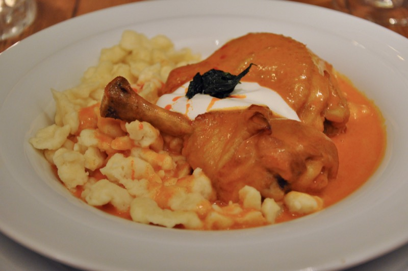
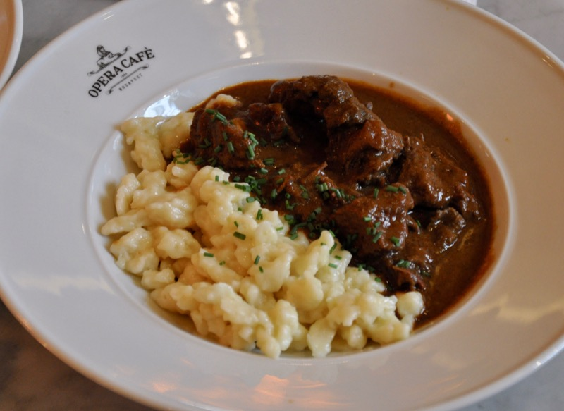
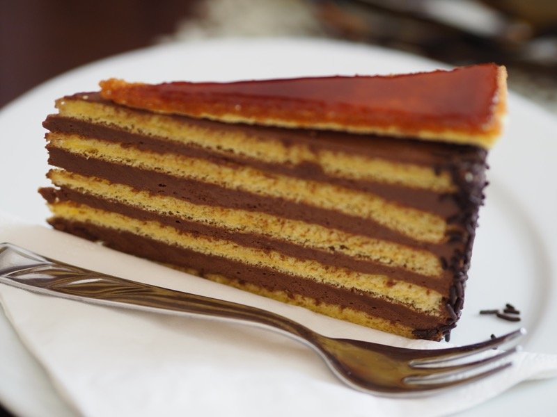

## Saturday Afternoon in Buda

### Walk to Buda side by crossing the famous bridge

Széchenyi Chain Bridge (Lánchíd) is the most famous bridge in the city: the . The Chain Bridge was the first to permanently connect Buda and Pest. At the time of its construction, the bridge was considered to be one of the wonders of the world. The road is hanging on iron chains – hence its name, and is held by the two classicist piers.

### Lunch at Pest-Buda Bistro
[Map](https://www.google.com/maps/place/Fortuna+u.+3,+Budapest,+1014+Hungary/@47.503307,19.03232,17z/data=!3m1!4b1!4m2!3m1!1s0x4741dc18b47f94b5:0x8a84a09552773657)

What used to be a pub is now a delightful restaurant that prides itself on serving simple home cooked food. The menu includes options like grilled sausages, oven baked flamed pies, and goulash soup. Pest-Buda Bistro is close to the castle and the cathedral, making it the perfect lunch or dinner break with excellent service and a charming seating area outside.

[Here](http://travelthisearth.com/pest-buda-bistro-dinner-review-budapest/) is a sample of what to expect.

### Walk around Castle District

Funicular ride from Adam Clark Sq (Chain Bridge) to Castle Hill top

- Royal Palace – Sculpture of mythical Turul bird
- Matthias Church – Trinity Statue – Fisherman’s Bastion
- Military Museum – Mary Magdalene Church Tower
- Toth Arpad Promenade – Arthur Gorgey Statue
- Palace of Buda: National Gallery – National Library – Budapest History Museum – Matthias Fountain

Once you get to the top, we suggest discovering Buda Castle and its surroundings. It offers an impressive panorama over Pest and the Danube river. Don’t forget to walk into the Castle’s patio which houses the Budapest History Museum.

From the Royal Palace, take Támok utca (street) until you get to Matthias Church, which costs 1,500Ft to visit and the Fisherman’s Bastion, from which you’ll get the best views across the city and the Hungarian Parliament.

Funicular ride from Castle Hill top to Adam Clark Sq by Chain Bridge... alternately we can walk back down.

### Dinner at New York Cafe
[Map](https://goo.gl/maps/QzDKNyhhjTL2)

The beating heart of the New York Palace hotel, the New York Café has preserved all the authentic decoration and flair that once made it an inspiration for the enquiring minds of Hungary's cultural and intellectual community. Cast your gaze upwards to the ceiling and you’ll see frescoes by Gusztav Mannheimer and Ferenc Eisenhut, dating back to the mid-1800s. All around you, Venetian glass lamps softly illuminate the marble columns and gilded stuccoes. Enveloped by this Belle Époque charm, you can relish the moment. Enjoy a conversation with your waiter or barman, follow the chef’s recommendations – and soak up the colour and the chatter of one of Europe’s most legendary destinations.

View the menus [here](NewYorkCafeMenu2019January_en.pdf).
Reservation is at 8:00pm.

## Sunday in Pest
### Walk up North for a morning stroll
- Shoes on the Danube Bank
- Liberty Square

[Map](https://goo.gl/maps/QzDKNyhhjTL2)

Markdown is a lightweight and easy-to-use syntax for styling your writing. It includes conventions for

### Dinner at Zeller Bistro
[Map](https://goo.gl/maps/QzDKNyhhjTL2)

## Monday (for Hunhun only)
### Lunch at Comme Chez Soi - very near the hotel
[Map](https://goo.gl/maps/7WY6EZN4cE82)
