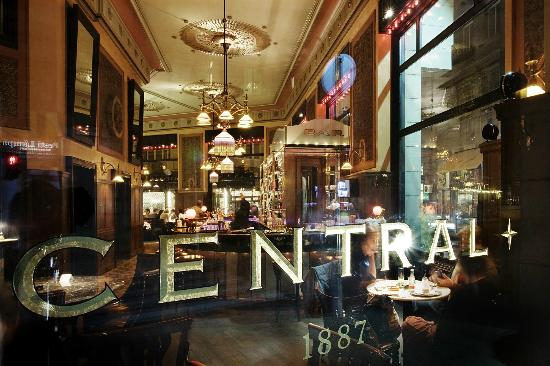
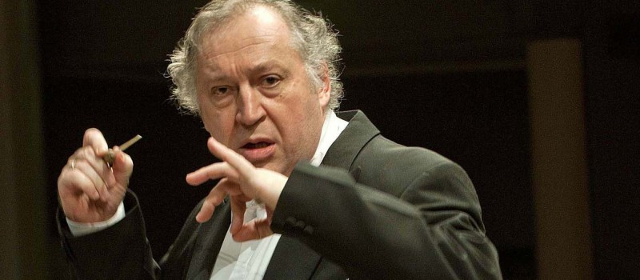
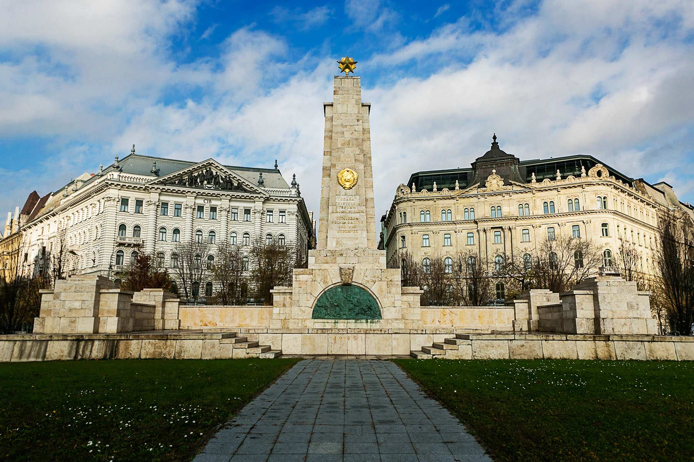
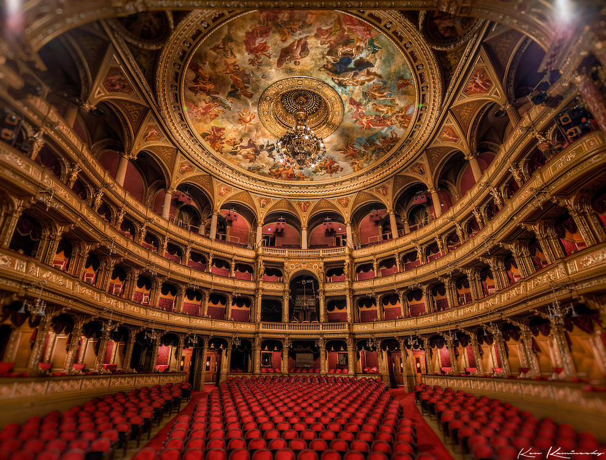
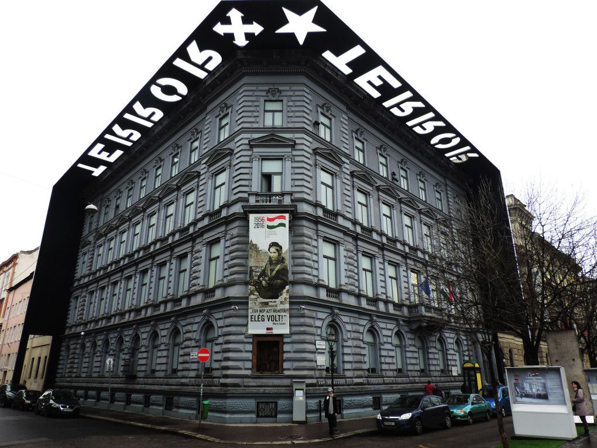
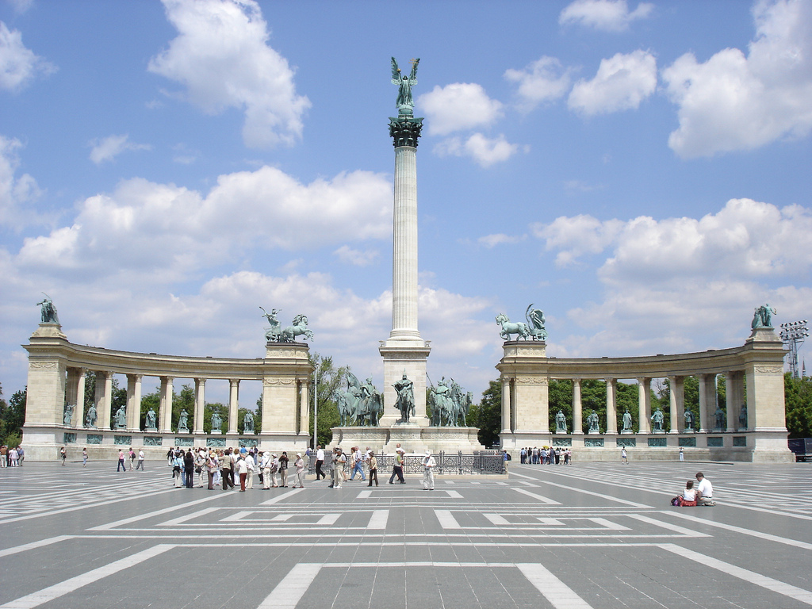

## Sunday in Pest

- Statue of Pálné Veres
- Hungarian National Museum

#### Free Tour in City Centre Budapest
Also a daily walking tour from 10am on the Pest side. This English language tour starts from the city centre (31 Vaci str., Budapest District V.), and features the most important attractions of Pest, such as the St. Stephen’s Basilica, the Hungarian Parliament and the Liberty Square.

Meeting time and location of Pest Walking tour: 10 am at Molnar’s Kurtoskalacs: 31 Vaci street, 1052 Budapest

#### Self Tour
St. Stephen’s Basilica, beautuiful church, climb up to the dome to the top.  staircase is beautiful and nice view of the city from the top.

Hungarian Parliament and the Liberty Square.

### Hungarian National Museum (Budapest Card)

### Brunch at Central Cafe
Founded in 1887, the Centrál Café is among the oldest of its kind in Budapest. It represents tradition and history, but is also open to new ideas. Its beautiful antique interior of paintings, vintage lights and elaborate wooden surfaces takes you back to 19th-century, even though you’re in the modern-day city centre. The kitchen focuses on Hungarian cuisine and serves excellent desserts as well as fine coffees.

We have an early reservation of 10:30 am to make it to the concert in time.

### MUPA
[Bus 2](https://goo.gl/maps/KnKVcQUkorK2)
 
[Bus 979A](https://goo.gl/maps/Z1cceCw3PJ82)

Debussy: Rhapsody No. 1 for Orchestra and Clarinet, La mer

More info on the concert [here](https://www.mupa.hu/en/program/classical-music-opera-theatre/mav-symphony-orchestra-2019-02-03_12-30-bela-bartok-national-concert-hall).

Here are our tickets [1](mupa1.pdf) [2](mupa2.pdf)

### Go Up North and walk around

### Shoes on the Danube Bank

### Liberty Square

### Ice Cream Shop

### Erzsébet Square

### Opera House

### Terror Museum

### Heroes Square

### Hall of Arts also known as the Kunsthalle (Budapest Card)
- City Park (Ice skating rink)
- Vajdahunyad Castle on an Artifical island
Cardboard paper to stone

### Dinner at Zeller Bistro
[Map](https://goo.gl/maps/QzDKNyhhjTL2)

[Day 3](monday.md)
